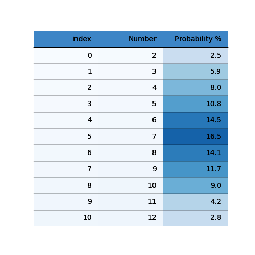
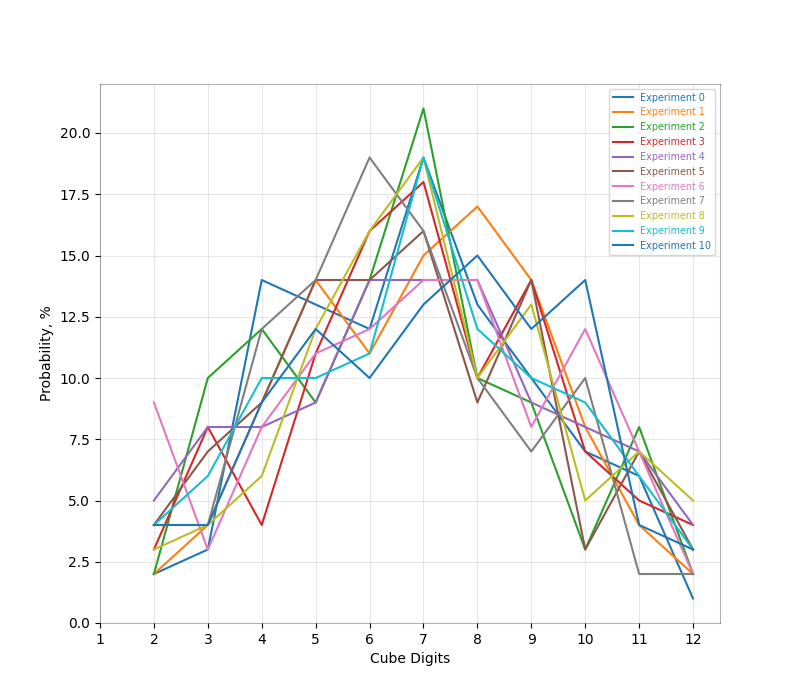

#### ВИЗНАЧЕННЯ ЙМОВІРНОСТІ ВИПАДІННЯ СУМИ ВІД 2 ДО 12 НА ДВОХ КУБИКАХ МЕТОДОМ МОНТЕ-КАРЛО

Для обчислення ймовірностей виконано наступні дії:

1. Згенеровані випадкові пари чисел від 1 до 6 100 разів.
2. Обчислена ймовірність випадіння суми від 2 до 12 через обчислення відношення кількості отриманих значень для кожної суми до загальної кількості імітацій (100).
3. Кроки 1 і 2 повторені 10 разів.
4. Визначені середні ймовірності для 10 сесій по 100 разів.

Нижче наведена таблиця зі значеннями для двох сесій. При новому запуску коду значення можуть трохи відрізнятись.

Стовпець 1 містить суми кидків, стовпець 2 - середнє для 10 сесій по 100 разів, наступні 5 стовпців - ймовірності для однієї окремої сесії, що включає 100 імітацій.

Середнє підраховувалось окремо від значень, наведених у стовпцях 3-7, тобто значення, наведені в різних стовпцях, є незалежними та генерувались в окремих сесіях, що дозволяє побачити, чи сильно значення варіюються між різними сесіями чи є більш-менш закономірними і тяжіють до визначеності.

Можна помітити, що в окремих поодиноких сесіях по 100 імітацій, відхилення є досить великим (наприклад 1% і 6% для значення 2 або 11% і 24% для значення 7). Іншими словами, використовуючи результати, отримані тільки від однієї сесії (100 імітацій), можна зробити хибні висновки.

Для 10 сесій по 100 імітацій результати показують більш загальну картину і в цілому відповідають середньому, яке можна вивести з результатів окремих 5 сесій. Оскільки результати другого стовпця рахувались окремо і при цьому відповідають середньому значенню сусідніх стовпців, бачимо, що ймовірності мають певну закономірність. Незалежно від сесії, але за умови великої кількості повторів та імітацій, результати є в певній мірі однаковими.

Для даного типу значень навряд чи можна визначити очікувані ймовірності зі 100% точністю, оскільки вони не мають фізичних меж (як, наприклад, площа фігури, де критерій точності є визначальним та вимірюваним). Тому в даному випадку визначаємо ймовірності як значення, що належать до певного проміжку. 

|Sum |Mean 10 | Session 1| Session 2 | Session 3 | Session 4 | Session 5|
|----|--------|----------|-----------|-----------|-----------|----------|
|2   |2.7%    |6%        |1%         |2%         |2%         |3%        |
|3   |5.4%    |8%        |5%         |2%         |6%         |4%        |
|4   |7.5%    |6%        |10%        |10%        |3%         |7%        |
|5   |10.9%   |7%        |7%         |10%        |11%        |7%        |
|6   |14.8%   |12%       |17%        |11%        |20%        |17%       |
|7   |16.1%   |11%       |14%        |24%        |20%        |24%       |
|8   |16.1%   |15%       |13%        |15%        |10%        |12%       |
|9   |9.8%    |13%       |17%        |10%        |13%        |11%       |
|10  |8.8%    |14%       |8%         |8%         |8%         |8%        |
|11  |5.4%    |3%        |5%         |5%         |5%         |5%        |
|12  |2.5%    |5%        |3%         |3%         |2%         |2%        |
 

Якщо узагальнити результати, наведені у таблиці (та представлені на графіку і у таблиці нижче), видно, що найчастіше випадають суми, значення яких знаходяться по середині значень вибірки, а саме - 6, 7, 8.

На 30-40% рідше видадають значення, що знаходяться справа і зліва від середніх (4, 5, 9, 10).
Значення 3 та 11 можуть не випасти при киданні менш, ніж 25 разів.
Значення 2 та 12 не завжди генерувались, навіть при 100 імітаціях. 

Значення, отримані методом Монте-Карло, приблизно відповідають значенням у таблиці для порівняння, прикріпленої до завдання.

Обидві таблиці наведені нижче.

Також результати візуалізовані у вигляді графіка.

#### ВІЗУАЛІЗАЦІЯ РЕЗУЛЬТАТІВ

Таблиця із завдання для порівняння результатів:

Таблиця результатів, отриманих в процесі обчислень.

Графік показує ймовірності 10 сесій по 100 імітацій.

В цілому, метод Монте-Карло дозволяє отримати результати, наближені до реальності. За певних умов (наприклад, велика кількість експериментів) із досить великою точністю. Тому його доцільно застосовувати в ситуаціях, де неможливо зібрати дані для аналізу звичайними способами. 

